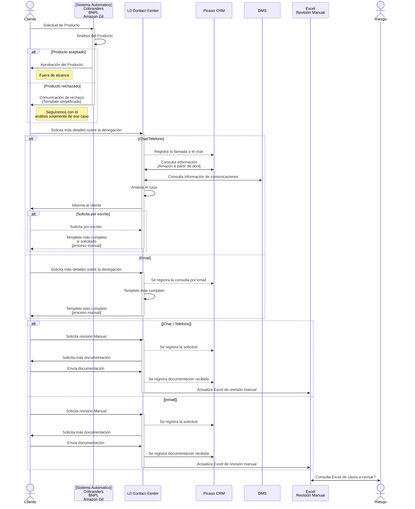
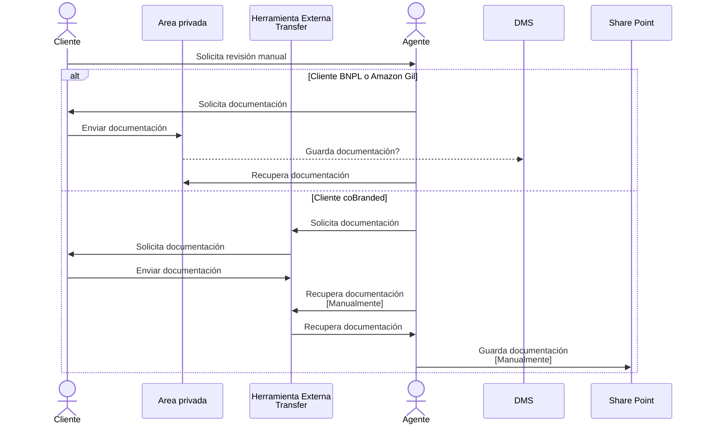
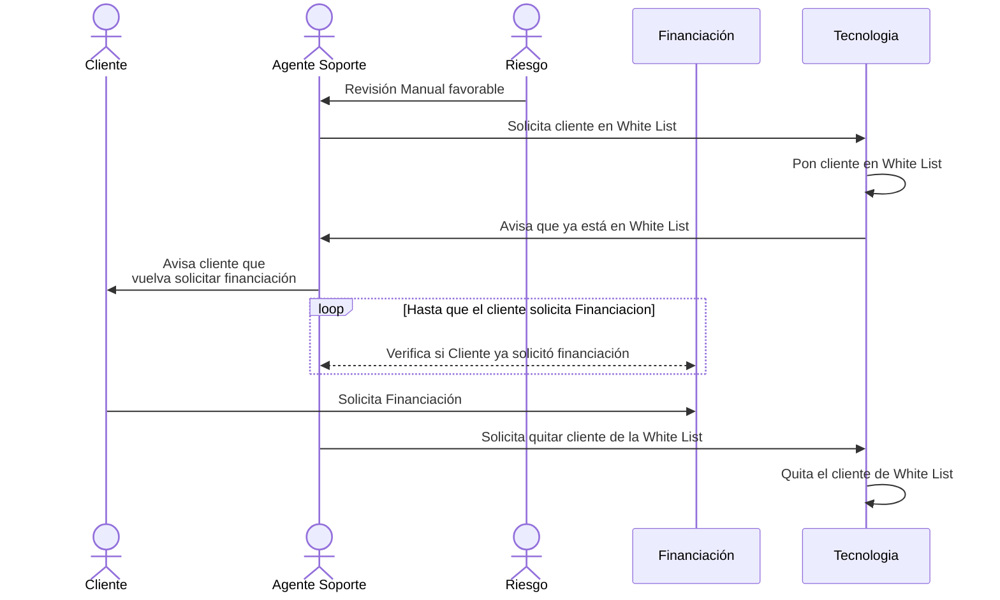
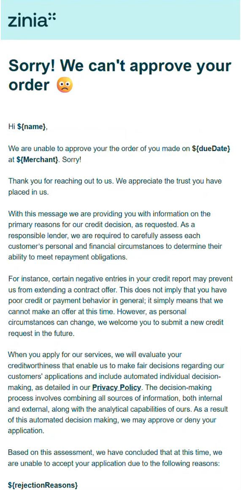
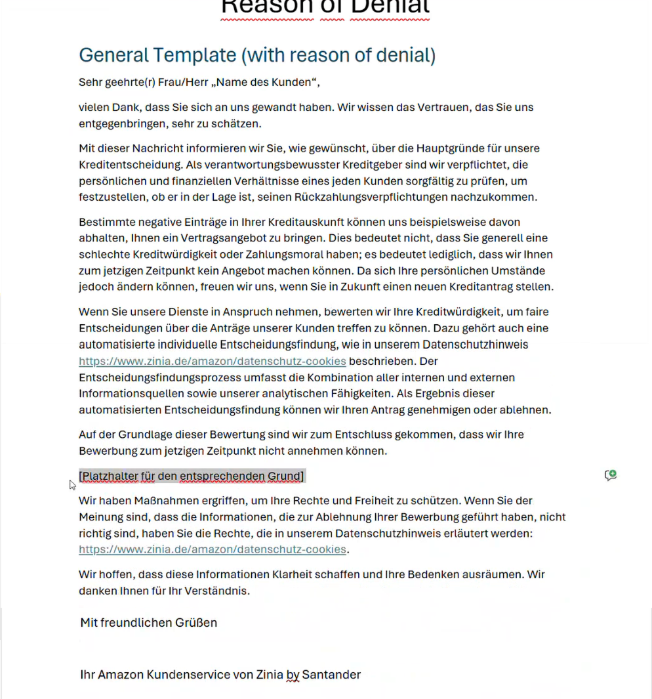
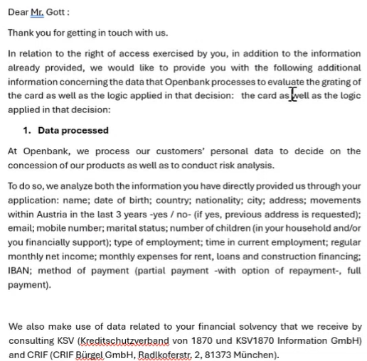
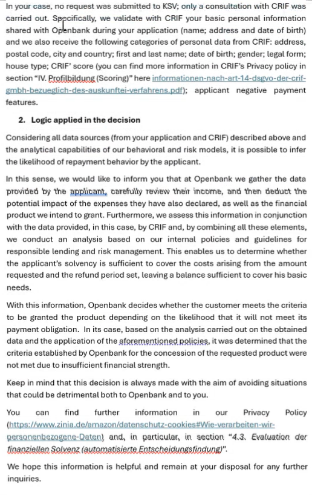

# Sesion1_20260219_MotivoDenegación + RevManual

- [Sesion1_20260219_MotivoDenegación + RevManual](#sesion1_20260219_motivodenegación--revmanual)
  - [Sesion 1](#sesion-1)
    - [Detalles](#detalles)
    - [Presentes](#presentes)
  - [Tenants](#tenants)
  - [Flujo Denegación](#flujo-denegación)
  - [Flujo envío de documentación](#flujo-envío-de-documentación)
  - [Flujo usuario aprobado en la revisión manual](#flujo-usuario-aprobado-en-la-revisión-manual)
  - [Comentarios](#comentarios)
  - [Dudas](#dudas)
  - [Ref](#ref)
    - [Template simplificado](#template-simplificado)
    - [Template completo](#template-completo)
    - [Respuesta detallada](#respuesta-detallada)
      - [32:16](#3216)
      - [32:44](#3244)
      - [38:03](#3803)
      - [41:17](#4117)
      - [45:50](#4550)

## Sesion 1

### Detalles

- [Video](https://everisgroup.sharepoint.com/:v:/s/ZINIAProyectoGDPR/IQBWnvlUzdoUSbcO33n4ivOMAWAseJlBNLN7SBxMnmLwyw4?e=Pae93g)
- [Carpeta con archivos recibidos](https://everisgroup.sharepoint.com/:f:/s/ZINIAProyectoGDPR/IgD96Ft4-r7LTrt-IUtoy5q7AdriJvcCGz9KrN-xG__4BUA?e=bbnECl)

### Presentes

- Pablo Gomez - Lobo Alamo
- Alejandro Iglesias Soilan
- Cesar De Juan Carrillo
- Paloma Sastre Sanchez Fabres
- Yolanda Tinajero Olivera
- Iliana Maria Broschat Garcia

## Tenants

- Cobranders
- BNPL
- Amazon Gil

## Flujo Denegación

## Flujo envío de documentación

## Flujo usuario aprobado en la revisión manual

Ese proceso es valido para CoBranded y BNPL

Para el caso de GIL riesgo está atado que no tiene la parte tecnica para hacer el white list

## Comentarios

- No hay envío o reenvío de comunicación de modo automatizado. Todo se hace de modo manual utilizando plantillas
- Alejando opina que no se está dando la respuesta tan detallada como se debía.
- El CRM sí que registra las llamadas - [38:03](#3803)
  - CoBranded funciona con Appian - DOC: [PROCESO DE GESTIÓN DE CASOS](https://everisgroup.sharepoint.com/:w:/s/ZINIAProyectoGDPR/IQDX6XVIfHUlSoDiGp9sM4QaAXvvUEw5FKh5W5SBN8OCJAY?e=6KLjrl)
  - "Mundo GIL" funcina con OPS Portal - **FALTA DOC -Proceso_Gestión_Casos_Motivos de ...**
- Deberían haber grupos que les permitan meterse en la herramienta descargar la historia y cronológicamente. No para todo mundo, para la gente de primera línea. - [45:50](#4550)
- Para saber que documentación hay que solicitar al cliente en caso de revisión manual, se consulta en el Excel [AMZ_Ablehnungen_translated](https://santandernet.sharepoint.com/c/t/sites/Cobranded426/_layouts/15/Doc.aspdsourcedoc=%7831E5228C-CD92-4750-952F-57839A1FAC167D&fle=AMZ_Ablehnungen_translated.xsx&action=default&mobileredirect=true). **NO TENEMOS ACCESO**

## Dudas

- ¿Picaso es el CRM que se cita en [41:17](#4117)?
- ¿Picaso se utiliza para todos los Tenants?
- ¿Risgo consulta el Excel de modo automatico? O se necesita que le avise manualmente que hay un nuevo caso?
- ¿Que es Appian?
- ¿Que es Korandeal?

## Ref

### Template simplificado

[Template versión HTML](https://everisgroup.sharepoint.com/:u:/s/ZINIAProyectoGDPR/IQAEA9vnvh_-SbgEfVNT64VQAXgZETYWgIGj-MEtuARhZsY?e=qKjAJj)

### Template completo

[Template completo doc](https://everisgroup.sharepoint.com/:w:/s/ZINIAProyectoGDPR/IQBBonEjclKWRqsQIFa1VWbIAeNNPAumlTU98dpStuKwa3E?e=qXgPDj)

### Respuesta detallada

Según lo que comenta Alejandro, minutos [32:16](#3216) y [32:44](#3244) del video. Tenemos el siguiente ejemplo de respuesta detallada.

#### 32:16

De enseñar Yolanda, no como plantilla inicial. Bueno, pues esto es lo que realmente te tendríamos que estar dando para poder directamente al usuario decirle, mira, esto es la información que tenemos, si no te gusta apáñatelas no porque estamos cubiertos y porque sabemos que si el usuario luego va a 1 a 1 autoridad, estamos bien con con con esta, pero veis la diferencia de la especificidad de lo que le decimos, Oye, es que tomamos estos datos, vamos aquí.

#### 32:44

En tu caso particular no hemos ido a k s V porque esto es un austríaco, pero si hemos ido a crif y de crif recogemos esto y la lógica aplicada es oye, pues de todo esto hacemos un Rich model y hacemos un análisis. Entonces aquí determinamos que tú no tienes Financial suficiente para para no morirte de hambre. Esto lo hacemos por ti. Si quieres algo más, tienes información aquí.

#### 38:03

Sí, sí que hay forma, sí, porque en mis interacciones en el histórico del cliente, cuando me meto en picazo veo por qué lo tengo. Exacto, vale, pues eso se puede ver durante la propia llamada y podríamos hacerlo. Vale, es una cuestión de dar robustez al a la respuesta y automatizar, y luego claramente que hay que quitarse la manualidad que queremos hacer de que la gente se ponga en durante la llamada, montar la respuesta de nivel dos, eso también hay que cambiar. ¿Vale? Vale de motivo de negación.

#### 41:17

En el hops portal no solo tendría visibilidad en mi CRM porque hay un motivo de llamada o de interacción que yo he registrado cliente me ha llamado revisión manual. Podría verlo porque la última interacción es una revisión manual y la antaría en un motivo de negación. Ahí sí que puedes hacer un poco la cronología. Tenemos riesgo operativo de de, de, de esa es es es fácilmente consultable por la gente. O sea, creemos que puede haber casos en por conseguir con el símil que dice Paloma de de garantizarse en.

#### 45:50

También lo tengo Pablo, el requerimiento, o sea, lo tengo para para lanzarlo. O sea, deberían haber grupos, deberían ver roles específicos que les permitan meterse en la herramienta, es decir, descarga de la historia y descargar todo cronológicamente. No para todo El Mundo, no para la gente de primera línea a lo mejor, pero para la la gente que estamos en backoffice, que necesitamos montar esa historia, necesitamos algo así
