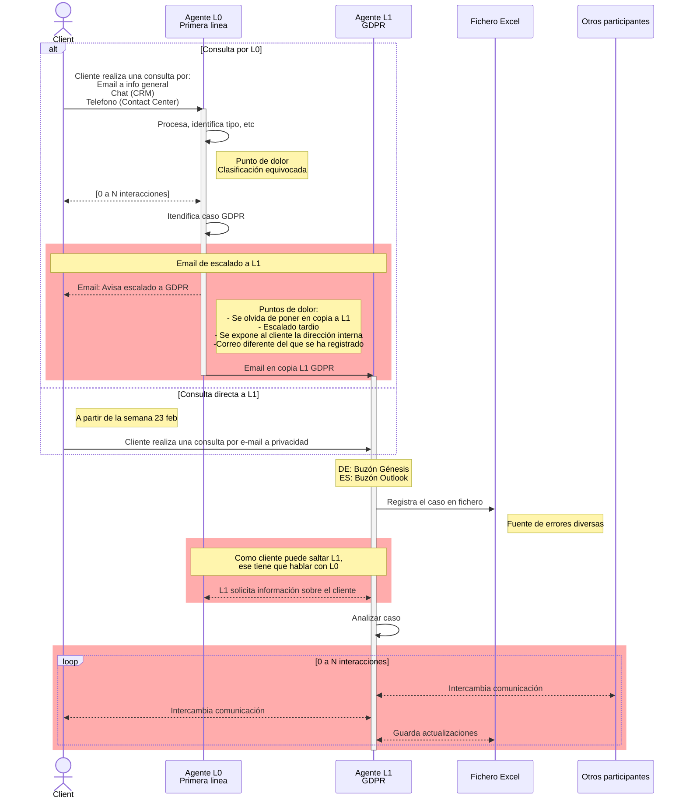
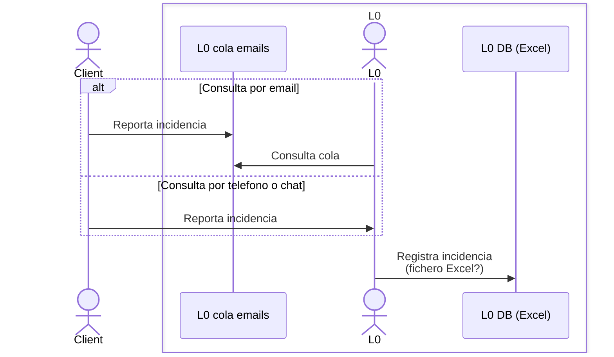
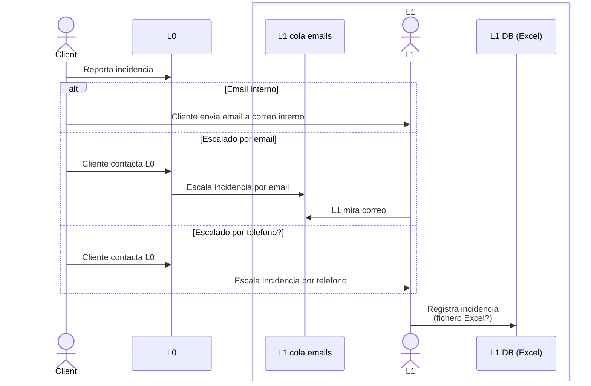

# Sesion2_20260220_Canales Entrada + Triaje

- [Sesion2_20260220_Canales Entrada + Triaje](#sesion2_20260220_canales-entrada--triaje)
  - [Triaje](#triaje)
  - [Comentarios](#comentarios)
  - [Dudas](#dudas)
    - [Duda: Registro Incidencia por parte de L0](#duda-registro-incidencia-por-parte-de-l0)
    - [Duda: Registro Incidencia por parte de L1](#duda-registro-incidencia-por-parte-de-l1)
  - [Ref](#ref)
    - [6:34](#634)
    - [6:54](#654)
    - [9:00](#900)
    - [10:10](#1010)
    - [28:33](#2833)
    - [29:54](#2954)

## Triaje

[Video](https://everisgroup.sharepoint.com/:v:/s/ZINIAProyectoGDPR/IQBWnvlUzdoUSbcO33n4ivOMAWAseJlBNLN7SBxMnmLwyw4?e=afV5Za)

Ese diagrama no están representados los flujos para los errores y excepciones.

## Comentarios

1. Centralizar el canal de entrada por un formulario - [6:34](#634). Se vuelve a hablar del formulario sobre el minuto 20 de la reunión dando más detalles de como sería el formulario.
2. Farga y Consumer están avanzando en definir un formulario. Quizás sea necesario alinear con ellos. [9:00](#900)
3. Muchas veces el usuario escribe directamente al email interno que fue expueto. Lo que hace que L1 tenga que contactar L0 para obtener contexto sobre ese cliente.
4. El cliente as veces contacta L0 o L1 con un correo diferente del que se ha registrado en el sistema - [29:54](#2954)
5. Se empezó la discusión sobre los casos de fraude. Pero no se fue a más detalles.

## Dudas

1. A qué Pablo se refiere "buscando en el lago" en el minuto [10:10](#1010)
2. En [28:33](#2833), ¿Yolanda quería decir al contrario? - Que con APIA sí que se puede evitar el problema de no haber puesto en cópia el usuario?
3. Como funciona el registro de incidencias por parte de L0? [VER](#duda-registro-incidencia-por-parte-de-l0)
4. Como funciona el registro de incidencias por parte de L1? [VER](#duda-registro-incidencia-por-parte-de-l1)

### Duda: Registro Incidencia por parte de L0

### Duda: Registro Incidencia por parte de L1

## Ref

### 6:34

Estos (Emails) son los externos, esto es donde me llegan directamente las peticiones de los clientes y aquí sería posible. Ale poner el formulario este del que hablaba Eduardo. O sea, quiero decir, porque parte del problema es la identificación no solo de que es un tema de GDPR, sino luego dentro de GDPR, el tipo de derecho.

### 6:54

Claro, en la idea es que el formulario vaya a lo mejor en en en página web, es decir, que sea una sección directamente donde el usuario ya meta ahí, y no tener el canal de comunicación de correos, sino que abierta o revierta directamente ese formulario en en nuestro canal interno no vale en nuestro buzón interno, de forma que evitemos ese contacto desde los canales de pues de privacy.

### 9:00

Y ahí un inciso, a lo mejor sería bueno liana y Alejandra, no sé cómo lo veis, si podemos ver lo que están montando la farga con con Consumer porque están avanzando, o sea un poco la estructura de campos, porque si tú y liana también lo preguntabas de si al final el cliente entiende al final lo que es el el el tipo de derecho, entonces si ellos.

### 10:10

Vale, luego hay algo en el corto que podríamos hacer, que que necesitamos sacar capacidad del equipo en ancho, pero se puede hacer que es todos los buzones se están buscando en el lago, todas las llamadas están buscando en el lago, si ahora mismo en, en, en y De hecho es un tema que Yolanda y Lorenzo ya habían levantado un momento, si, si, si con con I a les ayudamos un poco a hacer ese triaje, ya por lo menos simplificamos el el problema actual y luego para mí el tuvi claramente es el formulario.

### 28:33

Exacto, creo que hemos mejorado desde agosto del año pasado. Sí que hemos mejorado en cuanto a eso, a los casos que hemos subido con con retraso y tal, pero todavía queda camino por por recorrer. Hay mejoría, pero bueno, **con apia, como decía, sí que no podemos evitar el problema número dos de me olvido de poner al al al buzón en copia**, pero siempre tenemos el el riesgo de que la gente que lo gestiona de primera línea no reconozca que es un caso de GDPR.

### 29:54

Gracias por explorarlo y luego cuando dices que no me me llega el caso pero no me llega con toda la información. Hay esa información que tiene que que tiene que extraer alguien de algún sistema que la tiene que facilitar el cliente, **pues nos llega el caso a lo mejor en lo que el el cliente nos ha contactado desde un correo electrónico diferente al que ha utilizado para registrarse en el sistema.**
