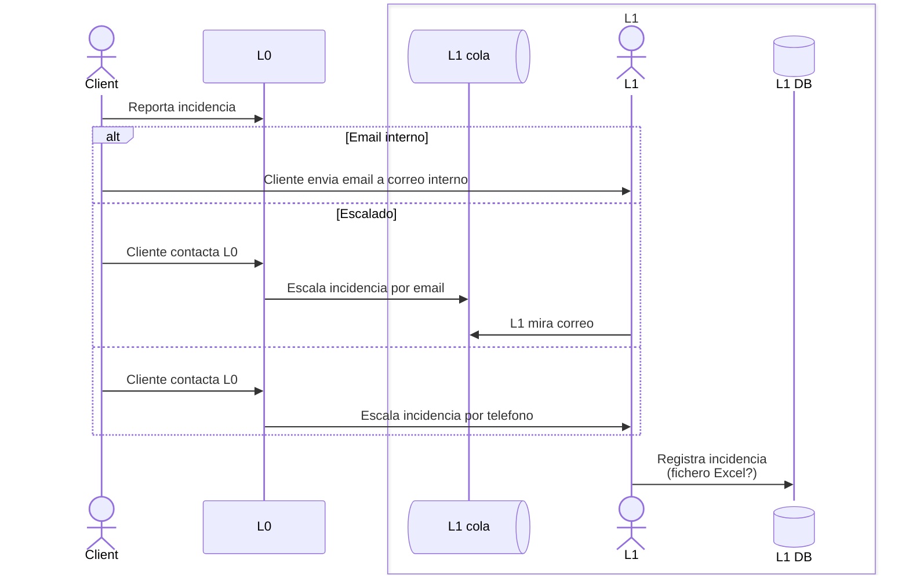

```mermaid
sequenceDiagram

Actor C as Client
Participant L0
Box L1
participant L1q@{"type":"queue"} as L1 cola
Actor L1
participant L1db@{"type":"database"} as L1 DB
end

C ->> L0: Reporta incidencia
alt Email interno
C ->> L1: Cliente envia email a correo interno
else Escalado
C ->> L0: Cliente contacta L0
L0 ->> L1q: Escala incidencia por email
L1 ->> L1q: L1 mira correo
else
C ->> L0: Cliente contacta L0
L0 ->> L1: Escala incidencia por telefono

end

L1 ->> L1db: Registra incidencia <br> (fichero Excel?)
```
